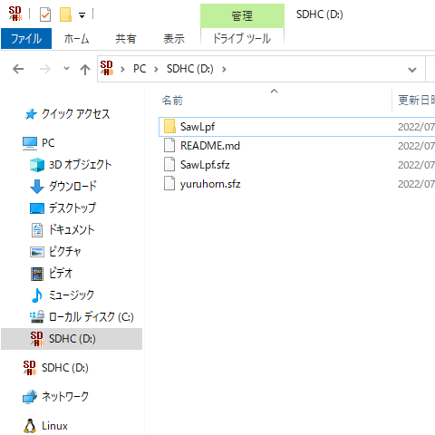
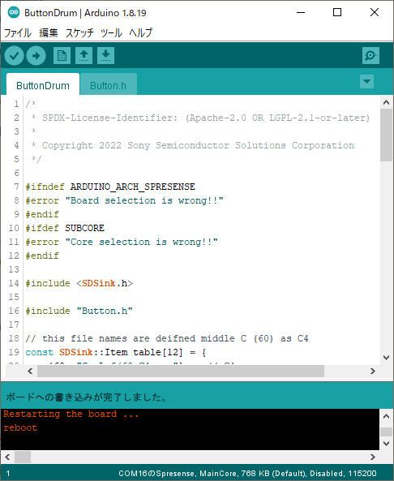

# ButtonDrum

ボタンを押すと音が鳴る、もっとも単純な楽器のサンプルです。

## 目次

* 構成ハードウェア
* 構成ソフトウェア
* ソースコード (抜粋)
* 音源ファイルを用意する
* インストール
* 演奏方法

## 構成ハードウェア

* [Spresense メインボード](https://developer.sony.com/ja/develop/spresense/specifications)
* [Spresense 拡張ボード](https://developer.sony.com/ja/develop/spresense/specifications)
* [Mic&LCD KIT for SPRESENSE](https://github.com/autolab-fujiwaratakayoshi/MIC-LCD_kit_for_SPRESENSE)
* microSDHCカード
    * 音源ファイル
* スピーカー
* micro-B USBケーブル

## 構成ソフトウェア

* [Spresense Reference Board](https://developer.sony.com/develop/spresense/docs/arduino_set_up_ja.html)
* [Sound Signal Processing Library for Spresense](https://github.com/SonySemiconductorSolutions/ssih-music/)

## ソースコード (抜粋)

```ButtonDrum.ino
#include <SDSink.h>

#include "Button.h"

const SDSink::Item table[2] = {
    {60, "SawLpf/60_C4.wav"},   // C4
    {61, "SawLpf/61_C#4.wav"}   // C#4
};
SDSink inst(table, 2);

Button button4(PIN_D04);
Button button5(PIN_D05);

void setup() {
    inst.begin();
}

void loop() {
    if (button4.hasChanged()) {
        if (button4.isPressed()) {                                      // ボタン4が押された
            inst.sendNoteOn(60, DEFAULT_VELOCITY, DEFAULT_CHANNEL);     //   →ノート番号60の音(60_C4.wav)を鳴らす
        } else {                                                        // ボタン4が離された
            inst.sendNoteOff(60, DEFAULT_VELOCITY, DEFAULT_CHANNEL);    //   →ノート番号60の音(60_C4.wav)を止める
        }
    }
    
    if (button5.hasChanged()) {
        if (button5.isPressed()) {                                      // ボタン5が押された
            inst.sendNoteOn(61, DEFAULT_VELOCITY, DEFAULT_CHANNEL);     //   →ノート番号61の音(61_C#4.wav)を鳴らす
        } else {                                                        // ボタン5が離された
            inst.sendNoteOff(61, DEFAULT_VELOCITY, DEFAULT_CHANNEL);    //   →ノート番号61の音(61_C#4.wav)を止める
        }
    }
    
    inst.update();                                                      // 楽器を動かす
}
```

## 音源ファイルを用意する

[サンプル音源](https://github.com/SonySemiconductorSolutions/ssih-music/releases/latest/download/assets.zip)をダウンロードして、展開したファイルをSDカードにコピーしてください。
ダウンロードしてZIP展開したファイルをSDカードにコピーします。
SDカードの直下に "SawLpf" フォルダがある状態にしてください。




## インストール

1. SDカードをSpresense拡張ボードに挿し込む。
2. "ButtonDrum" をインストールする。
    1. "ファイル" > "スケッチ例" > "Sound Signal Processing Library for Spresense" > "ButtonDrum" をクリックする。
    2. "ツール" > "ボード" > "Spresense Boards" > "Spresense" をクリックする。
    3. "ツール" > "Core" > "MainCore" をクリックする。
    4. "ツール" > "シリアルポート" からSpresenseが接続されているCOMポートをクリックする。
    5. "スケッチ" > "マイコンボードに書き込む" をクリックする。
    6. "ボードへの書き込みが完了しました。" と表示されるまで待つ。



## 演奏方法

Mic&LCD KIT for SPRESENSEのボタン4・ボタン5を押すと、それぞれに対応した音が鳴ります。
