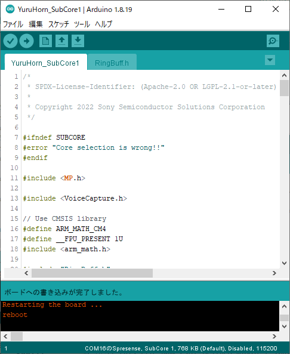
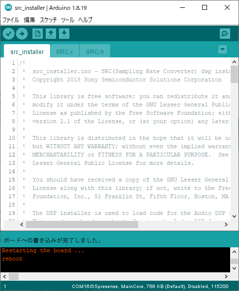
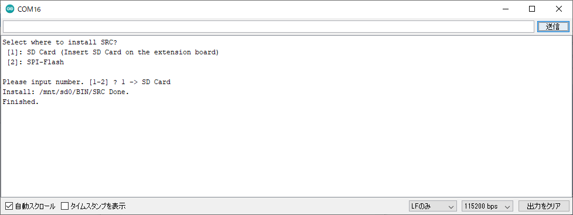
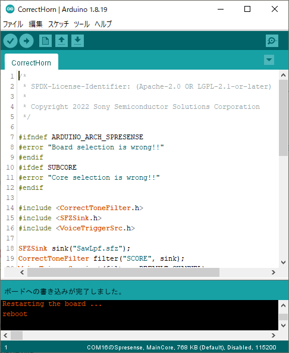

# CorrectHorn

鼻歌を歌うことでMIDIファイルを演奏することができるサンプルです。

## 目次

* 構成ハードウェア
* 構成ソフトウェア
* ソースコード (抜粋)
* 楽譜ファイルを用意する
* 音源ファイルを用意する
* インストール
* 演奏方法

## 構成ハードウェア

* [Spresense メインボード](https://developer.sony.com/ja/develop/spresense/specifications)
* [Spresense 拡張ボード](https://developer.sony.com/ja/develop/spresense/specifications)
* microSDHCカード
    * MIDIファイル
    * SFZ音源ファイル
    * DSPバイナリファイル (SRC)
* スピーカー
* micro-B USBケーブル

## 構成ソフトウェア

* [Spresense Reference Board](https://developer.sony.com/develop/spresense/docs/arduino_set_up_ja.html)
* [Sound Signal Processing Library for Spresense](https://github.com/SonySemiconductorSolutions/ssih-music/)

## ソースコード (抜粋)

```CorrectHorn.ino
#include <CorrectToneFilter.h>
#include <SFZSink.h>
#include <VoiceTriggerSrc.h>

// SFZ音源ファイルを指定します。
SFZSink sink("SawLpf.sfz");

// 演奏したい楽譜ファイルを指定します。
CorrectToneFilter filter("score.mid", sink);
VoiceTriggerSrc inst(filter, DEFAULT_CHANNEL);

void setup() {
    inst.begin();
}

void loop() {
    inst.update();
}
```

## 楽譜ファイルを用意する

[MusicBox](/examples/MusicBox/README.md)の「楽譜ファイルを用意する」を参照して、楽譜ファイルを用意してください。

## 音源ファイルを用意する

[MusicBox](/examples/MusicBox/README.md)の「音源ファイルを用意する」を参照して、音源ファイルを用意してください。

## インストール

1. SDカードをSpresense拡張ボードに挿し込む。
2. "YuruHorn_SubCore1" をインストールする。
    1. "ファイル" > "スケッチ例" > "Sound Signal Processing Library for Spresense" > "YuruHorn_SubCore1" をクリックする。
    2. "ツール" > "ボード" > "Spresense Boards" > "Spresense" をクリックする。
    3. "ツール" > "Core" > "SubCore 1" をクリックする。
    4. "ツール" > "シリアルポート" からSpresenseが接続されているCOMポートをクリックする。
    5. "スケッチ" > "マイコンボードに書き込む" をクリックする。
    6. "ボードへの書き込みが完了しました。" と表示されるまで待つ。
3. DSPバイナリファイルをインストールする。
    1. "ファイル" > "スケッチ例" > "Audio" > "dsp_installer"  > "src_installer" をクリックする。
    2. "ツール" > "Core" > "MainCore" をクリックする。
    3. "スケッチ" > "マイコンボードに書き込む" をクリックする。
    4. "ボードへの書き込みが完了しました。" と表示されるまで待つ。
    5. "ツール" > "シリアルモニタ" をクリックする。
    6. "Select where to install SRC?" と聞かれるので "1" と入力して "送信" をクリックする。
    7. "Finished" と表示されるまで待つ。
4. "CorrectHorn" をインストールする。
    1. "ファイル" > "スケッチ例" > "Sound Signal Processing Library for Spresense" > "CorrectHorn" をクリックする。
    2. "ツール" > "Core" > "MainCore" をクリックする。
    3. "スケッチ" > "マイコンボードに書き込む" をクリックする。
    4. "ボードへの書き込みが完了しました。" と表示されるまで待つ。






## 演奏方法

ボタンを押すごとに、楽譜の音が出るタイミングに応じた音が指定した音源で再生できます。
曲の音の変化のタイミングでボタンを押すことで楽譜の曲を奏でることができます。

## 高度な設定

一般的にMIDIファイル(スタンダードMIDIファイル)は、複数の演奏パートの演奏情報を含んでいます。

しかし、本ライブラリには同時に鳴らせる音の数(和音数)に限りがあるため、すべてのパートの演奏ができないことがあります。
その場合は `setParam` を使って、再生対象の演奏パートを絞り込むことで改善する場合があります。

### 再生するチャンネルを絞り込む

再生対象の演奏パートをチャンネル番号を使って絞り込むことができます。
チャンネル番号は演奏パートを区別するために使われる1～16の数値です。
再生対象の演奏パートにどのチャンネル番号が割り当てられているかは、DAWソフトでMIDIファイルを開くと確認することができます。

チャンネル2を再生させたい場合は、以下のようにしてチャンネル2だけが再生されるようにフィルタリングします。

```CorrectHorn.ino
#include "Button.h"
#include <CorrectToneFilter.h>
#include <SFZSink.h>

SFZSink sink("SawLpf.sfz");
CorrectToneFilter filter("score.mid", sink);
VoiceTriggerSrc inst(filter, 2); //変更

void setup() {
    inst.begin();
}

void loop() {
    inst.update();
}
```

### 再生するトラックを絞り込む

再生するMIDIファイルがフォーマット1のときに限り、再生対象のトラックを指定することで演奏パートを絞り込むことができます。
MIDIファイルがフォーマット1かどうか、再生対象の演奏パートがどの何番目のトラックに割り当てられているかは、DAWソフトでMIDIファイルを開くと確認することができます。

第3トラックを再生させたい場合は、以下のようにして第1トラックと第3トラックが再生されるようにフィルタリングします。

```CorrectHorn.ino
#include "Button.h"
#include <CorrectToneFilter.h>
#include <SFZSink.h>

SFZSink sink("SawLpf.sfz");
CorrectToneFilter filter("score.mid", sink);
VoiceTriggerSrc inst(filter, DEFAULT_CHANNEL);

void setup() {
    inst.setParam(ScoreFilter::PARAMID_TRACK_MASK, 0x00000000); // 再生対象トラックをクリアする
    inst.setParam(ScoreFilter::PARAMID_ENABLE_TRACK, 2);        // 第3トラック(再生したいトラック)を再生対象に追加する
    inst.begin();
}

void loop() {
    inst.update();
}
```
