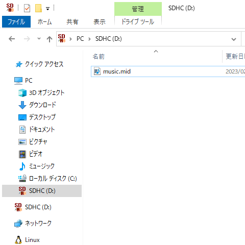
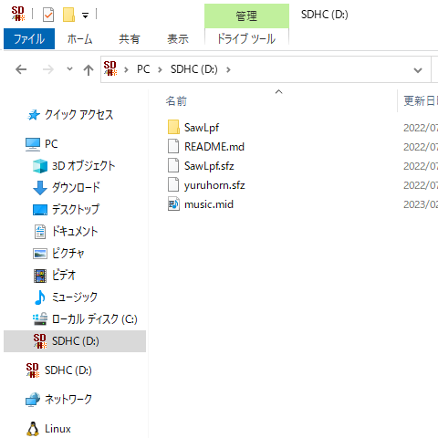
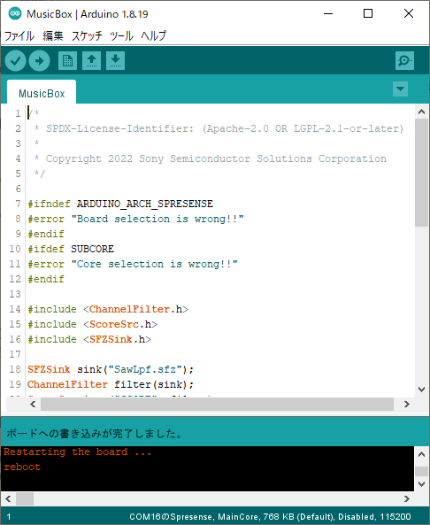

# MusicBox

楽譜ファイルをSFZ音源ファイルを使って演奏するサンプルです。

## 目次

* 構成ハードウェア
* 構成ソフトウェア
* ソースコード (抜粋)
* 楽譜ファイルを用意する
* 音源ファイルを用意する
* 演奏方法
* 高度な設定
    * 再生するチャンネルを選択する
    * 再生するトラックを選択する

## 構成ハードウェア

* [Spresense メインボード](https://developer.sony.com/ja/develop/spresense/specifications)
* [Spresense 拡張ボード](https://developer.sony.com/ja/develop/spresense/specifications)
* microSDHCカード
    * MIDIファイル
    * SFZ音源ファイル
* スピーカー
* micro-B USBケーブル

## 構成ソフトウェア

* [Spresense Reference Board](https://developer.sony.com/develop/spresense/docs/arduino_set_up_ja.html)
* [Sound Signal Processing Library for Spresense](https://github.com/SonySemiconductorSolutions/ssih-music/)

## ソースコード (抜粋)

```MusicBox.ino
#include <ChannelFilter.h>
#include <ScoreSrc.h>
#include <SFZSink.h>

SFZSink sink("SawLpf.sfz");         // SFZ音源ファイルの音を出すモジュールです。SFZ音源ファイルを指定します。
ChannelFilter filter(sink);         // 再生するチャンネル番号を選択するモジュールです。
ScoreSrc inst("SCORE", filter);     // 楽譜ファイルを読み込むモジュールです。再生する楽譜ファイルを指定します。

void setup() {
    inst.begin();                                               // 楽器を初期化する
    inst.setParam(ScoreSrc::PARAMID_STATUS, ScoreSrc::PLAY);    // 楽譜を再生する
}

void loop() {
    inst.update();                                              // 楽器を動かす
}
```

## 楽譜ファイルを用意する

以下の手順で楽譜ファイルを設定します。
1. 楽譜ファイルを用意する。
2. 楽譜ファイルをSDカードにコピーする。
3. 楽譜ファイルのファイル名を `ScoreSrc` に設定する。

まず、楽譜ファイルを用意します。
本スケッチでは楽譜ファイルとしてスタンダードMIDIファイル(以下、MIDIファイル)の再生に対応しています。
MIDIファイルは自分で作成するか、販売・配布されているものを入手してください。

**注意: 販売・配布されているMIDIファイルを使用する場合には、提供者の定める利用規約や著作権、ライセンスをよく確認し順守して使用してください。**

MIDIファイル配布サイトの例:
* [ぷりんと楽譜](https://www.print-gakufu.com/)
* [Wikimedia Commons](https://commons.wikimedia.org/wiki/)
    * [Category:MIDI files](https://commons.wikimedia.org/wiki/Category:MIDI_files)
* [フリーBGM Music with myuu](https://www.ne.jp/asahi/music/myuu/)

MIDIファイルが用意できたら、MIDIファイルをSDカードにコピーします。
ここではファイル名を "music.mid" としています。



SDカードにコピーしたMIDIファイルのファイル名を、スケッチの `ScoreSrc` のパラメータとして渡します。

```MusicBox.ino
ScoreSrc inst("music.mid", filter); // 楽譜ファイルを読み込むモジュールです。再生する楽譜ファイルを指定します。
```

## 音源ファイルを用意する

以下の手順で音源ファイルを設定します。
1. SFZ音源ファイルを用意する。
2. SFZ音源ファイルをSDカードにコピーする。
3. SFZファイルのファイル名を `SFZSink` に設定する。

まず、SFZ音源ファイルを用意します。
SFZ音源ファイルは[サンプル音源](https://github.com/SonySemiconductorSolutions/ssih-music/releases/latest/download/assets.zip)(SawLpf.sfz)を使用するか、販売・配布されているものを入手してください。
販売・配布されているSFZ音源ファイルは、そのままでは本ライブラリで使用できない場合があります。
使用できない場合はインポートツール[import-sfz.py](../../tools/README.md)で変換すると使用できるようになる場合があります。

**注意: 販売・配布されているSFZ音源ファイルを使用する場合には、提供者の定める利用規約や著作権、ライセンスをよく確認し順守して使用してください。**
**インポートツールを使用する場合はSFZファイルと音声ファイルの加工を伴うため、加工に関する条項にも注意してください。**

SFZ音源ファイル配布サイトの例:
* [Versilian Studios LLC.](https://vis.versilstudios.com/)
    * [VSCO Community](https://vis.versilstudios.com/vsco-community.html)
* [Virtual Playing Orchestra](http://virtualplaying.com/virtual-playing-orchestra/)
* [The FreePats project](https://freepats.zenvoid.org/)
* [SFZ Instruments](https://sfzinstruments.github.io/)

SFZ音源ファイルが用意できたら、ファイルをSDカードにコピーします。
サンプル音源の場合は "SawLpf.sfz" ファイルと "SawLpf" フォルダをコピーします。



SDカードにコピーしたSFZファイルのファイル名を、スケッチの `SFZSink` のパラメータとして渡します。

```MusicBox.ino
SFZSink sink("SawLpf.sfz");         // SFZ音源ファイルの音を出すモジュールです。SFZ音源ファイルを指定します。
```

## インストール

1. SDカードをSpresense拡張ボードに挿し込む。
2. "MusicBox" をインストールする。
    1. "ファイル" > "スケッチ例" > "Sound Signal Processing Library for Spresense" > "MusicBox" をクリックする。
    2. "ツール" > "ボード" > "Spresense Boards" > "Spresense" をクリックする。
    3. "ツール" > "Core" > "MainCore" をクリックする。
    4. "ツール" > "シリアルポート" からSpresenseが接続されているCOMポートをクリックする。
    5. "スケッチ" > "マイコンボードに書き込む" をクリックする。
    6. "ボードへの書き込みが完了しました。" と表示されるまで待つ。



## 演奏方法

Spresenseの電源をオンにすると、指定したMIDIファイルを、指定したSFZ音源ファイルで再生されます。

## 高度な設定

一般にMIDIファイルは複数の演奏パートの演奏情報を含んでいます。
本ライブラリには同時に鳴らせる音の数に限りがあるため、すべてのパートの演奏ができないことがあります。
その場合は、再生するチャンネルやトラックを選択することで、音が改善する場合があります。

この機能を使う前に、再生しようとしているMIDIファイルのフォーマットを確認する必要があります。
多くのMIDIファイルはフォーマット0(シングルトラック)かフォーマット1(マルチトラック)の形式になっています。
フォーマット0のMIDIファイルは互換性の高い形式ですが、すべてのパートが1つのトラックに収められているため、トラックでパートを選択することができません。

**注意: フォーマット0のとき、第1トラックを再生すると全パートが演奏され、それ以外のトラック(存在しない)を再生すると何も演奏されません。**

| MIDIファイルのフォーマット | チャンネルによるパート選択 | トラックによるパート選択 |
| ---                        | ----                       | ----                     |
| フォーマット0              | 可能                       | 不可能                   |
| フォーマット1              | 可能                       | 可能                     |

以下に、コマンドラインツールMIDICSVを使ったフォーマットの確認方法を示します。

```console.log
$ midicsv format0.mid
0, 0, Header, 0, 1, 480
...
```

1行目に注目してください。カンマで区切られた4つ目の値がフォーマット、5つ目の値がMIDIファイルに含まれるトラック数です。
format0.mid はフォーマット0のMIDIファイルで、ただ1つのトラックがあることが分かります。
このファイルではトラックによるパート選択はできません。

```console.log
$ midicsv format1.mid
0, 0, Header, 1, 11, 480
...
```

同様に format1.mid はフォーマット1のMIDIファイルで、11のトラックからなります。
このファイルではチャンネルとトラックのどちらでパート選択をすることができます。

### 再生するチャンネルを選択する

一般的にMIDIファイルでは、演奏パートにチャンネル番号が割り当てられています。
`ChannelFilter`で再生対象のチャンネル番号を選択することができます。

チャンネル番号は1から16の数値です。
何も設定をしないとき、本スケッチはすべてのチャンネル番号を再生対象とします。

```MusicBox.ino
void setup() {
    inst.begin();
}

void loop() {
    inst.update();  // チャンネル番号1～16のすべての演奏パートが再生される
}
```

ここで、メロディパートだけが再生されるように設定してみましょう。
演奏パートにどのチャンネル番号が割り当てられているかは、DAWでMIDIファイルを開くと確認することができます。
ここではメロディパートにチャンネル番号2が割り当てられていることとします。

設定するパラメータは2種類です。
まず、すべてのチャンネル番号を無効化するために`PARAMID_CHANNEL_MASK`に0を設定します。
続けて`PARAMID_ENABLE_CHANNEL`で有効化するチャンネル番号を指定すると、指定したチャンネル番号だけが再生されるようになります。

```MusicBox.ino
void setup() {
    inst.begin();
    inst.setParam(ChannelFilter::PARAMID_CHANNEL_MASK, 0);      // すべてのチャンネル番号を無効化して、
    inst.setParam(ChannelFilter::PARAMID_ENABLE_CHANNEL, 2);    // チャンネル番号2を有効化する。
}

void loop() {
    inst.update();  // チャンネル番号2の演奏パートだけが再生される
}
```

### 再生するトラックを選択する

MIDIファイルの形式がフォーマット1のときに限り、`ScoreSrc`で再生対象のトラックを選択することができます。
何も設定をしないとき、本スケッチはすべてのトラック(最大32トラック)を再生対象とします。

```MusicBox.ino
void setup() {
    inst.begin();
}

void loop() {
    inst.update();  // すべてのトラックが再生される
}
```

ここで、メロディパートだけが再生されるように設定してみましょう。
演奏パートのトラックは、DAWでMIDIファイルを開くと確認することができます。
ここでは第1トラックがコンダクタートラック、第3トラックがメロディパートだったとします。

コンダクタートラックとは、MIDIファイルがフォーマット1のときにテンポ情報や拍子情報が格納される第1トラックのことです。

設定するパラメータは2種類です。
まず、すべてのトラックを無効化するために`PARAMID_TRACK_MASK`に0を設定します。
続けて`PARAMID_ENABLE_TRACK`で有効化するトラック(0オリジン)を指定すると、指定したトラックだけが再生されるようになります。

ここで、メロディパートだけでなくコンダクタートラックを有効化することを忘れないでください。
コンダクタートラックが無効化されていると、作者が意図したテンポでの再生ができなくなります。

```MusicBox.ino
void setup() {
    inst.begin();
    inst.setParam(ScoreFilter::PARAMID_TRACK_MASK, 0);      // すべてのトラックを無効化して、
    inst.setParam(ScoreFilter::PARAMID_ENABLE_TRACK, 0);    // 第1トラック(コンダクタートラック)と
    inst.setParam(ScoreFilter::PARAMID_ENABLE_TRACK, 2);    // 第3トラック(メロディパート)を有効化する。
}

void loop() {
    inst.update();  // 第3トラックだけが再生される
}
```
