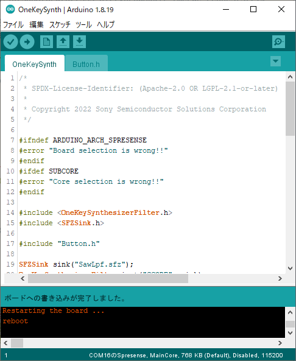

# OneKeySynthesizer

ボタン1つでMIDIファイルを演奏することができるサンプルです。

## 目次

* 構成ハードウェア
* 構成ソフトウェア
* ソースコード (抜粋)
* 楽譜ファイルを用意する
* 音源ファイルを用意する
* 演奏対象のチャンネルを設定する
* インストール
* 演奏方法

## 構成ハードウェア

* [Spresense メインボード](https://developer.sony.com/ja/develop/spresense/specifications)
* [Spresense 拡張ボード](https://developer.sony.com/ja/develop/spresense/specifications)
* microSDHCカード
    * MIDIファイル
    * SFZ音源ファイル
* スピーカー
* micro-B USBケーブル

## 構成ソフトウェア

* [Spresense Reference Board](https://developer.sony.com/develop/spresense/docs/arduino_set_up_ja.html)
* [Sound Signal Processing Library for Spresense](https://github.com/SonySemiconductorSolutions/ssih-music/)

## ソースコード (抜粋)

```OneKeySynth.ino
#include <OneKeySynthesizerFilter.h>
#include <SFZSink.h>

SFZSink sink("SawLpf.sfz");                         // SFZ音源ファイルの音を出すモジュールです。SFZ音源ファイルを指定します。
OneKeySynthesizerFilter inst("score.mid", sink);    // 楽譜ファイルを読み込むモジュールです。再生する楽譜ファイルを指定します。

Button button4(PIN_D04);

int PLAY_CHANNEL = 1;                               // 楽譜ファイルの中でチャンネル番号1を演奏対象とする

void setup() {
    inst.begin();                                                       // 楽器を初期化する
}

void loop() {
    if (button4.hasChanged()) {
        if (button4.isPressed()) {                                      // ボタン4が押されたら、楽譜の次の音を鳴らす
            inst.sendNoteOn(OneKeySynthesizerFilter::NOTE_ALL, DEFAULT_VELOCITY, PLAY_CHANNEL);
        } else {                                                        // ボタン4が離されたら、鳴らしていた音を止める
            inst.sendNoteOff(OneKeySynthesizerFilter::NOTE_ALL, DEFAULT_VELOCITY, PLAY_CHANNEL);
        }
    }

    inst.update();                                                      // 楽器を動かす
}
```

## 楽譜ファイルを用意する

[MusicBox](/examples/MusicBox/README.md)の「楽譜ファイルを用意する」を参照して、楽譜ファイルを用意してください。

## 音源ファイルを用意する

[MusicBox](/examples/MusicBox/README.md)の「音源ファイルを用意する」を参照して、音源ファイルを用意してください。

## 演奏対象のチャンネルを設定する

一般にMIDIファイルは複数の演奏パートの演奏情報を含んでいます。
`OneKeySynthesizerFilter`は、`sendNoteOn`関数で指定したチャンネル番号の音を1つ読み進めるので、演奏対象のチャンネル番号をあらかじめ調べておく必要があります。
演奏パートにどのチャンネル番号が割り当てられているかは、DAWでMIDIファイルを開くと確認することができます。
ここでは演奏したいパートにチャンネル番号1が割り当てられていることとします。

チャンネル番号は以下のように設定します。

```OneKeySynth.ino
int PLAY_CHANNEL = 1;                                                   // 楽譜ファイルの中でチャンネル番号1を演奏対象とする
```

## インストール

1. SDカードをSpresense拡張ボードに挿し込む。
2. "OneKeySynth" をインストールする。
    1. "ファイル" > "スケッチ例" > "Sound Signal Processing Library for Spresense" > "OneKeySynth" をクリックする。
    2. "ツール" > "ボード" > "Spresense Boards" > "Spresense" をクリックする。
    3. "ツール" > "Core" > "MainCore" をクリックする。
    4. "ツール" > "シリアルポート" からSpresenseが接続されているCOMポートをクリックする。
    5. "スケッチ" > "マイコンボードに書き込む" をクリックする。
    6. "ボードへの書き込みが完了しました。" と表示されるまで待つ。



## 演奏方法

Mic&LCD KIT for SPRESENSEのボタン4を押すと、楽譜の音を1つずつ読み進めながら音を鳴らします。
曲のリズムでボタンを押すと正しく曲が演奏できます。
