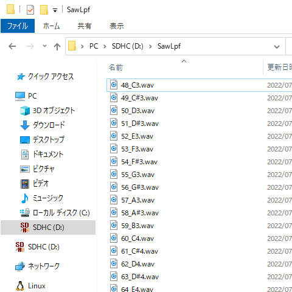
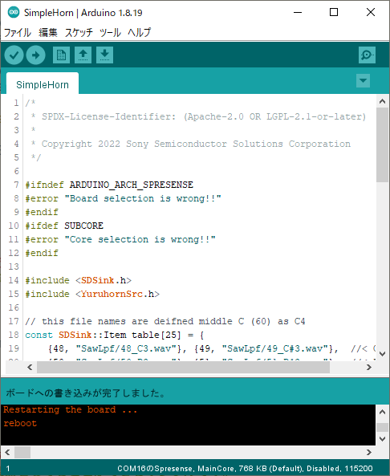

# SimpleHorn

鼻歌を歌うだけでトランペットのように楽器を奏でることができるサンプルです。

## 目次

* 構成ハードウェア
* 構成ソフトウェア
* ソースコード (抜粋)
* 音源ファイルを用意する
* インストール
* 演奏方法

## 構成ハードウェア

* [Spresense メインボード](https://developer.sony.com/ja/develop/spresense/specifications)
* [Spresense 拡張ボード](https://developer.sony.com/ja/develop/spresense/specifications)
* microSDHCカード
    * MIDIファイル
    * 音源ファイル
    * DSPバイナリファイル (SRC)
* スピーカー
* micro-B USBケーブル

## 構成ソフトウェア

* [Spresense Reference Board](https://developer.sony.com/develop/spresense/docs/arduino_set_up_ja.html)
* [Sound Signal Processing Library for Spresense](https://github.com/SonySemiconductorSolutions/ssih-music/)

## ソースコード (抜粋)

```SimpleHorn.ino
#include <SDSink.h>
#include <YuruhornSrc.h>

// ノート番号に音源ファイルを割り当てます
const SDSink::Item table[25] = {
    {48, "SawLpf/48_C3.wav"}, {49, "SawLpf/49_C#3.wav"},  //< C3, C#3
    {50, "SawLpf/50_D3.wav"}, {51, "SawLpf/51_D#3.wav"},  //< D3, D#3
    {52, "SawLpf/52_E3.wav"},                             //< E3
    {53, "SawLpf/53_F3.wav"}, {54, "SawLpf/54_F#3.wav"},  //< F3, F#3
    {55, "SawLpf/55_G3.wav"}, {56, "SawLpf/56_G#3.wav"},  //< G3, G#3
    {57, "SawLpf/57_A3.wav"}, {58, "SawLpf/58_A#3.wav"},  //< A3, A#3
    {59, "SawLpf/59_B3.wav"},                             //< B3
    {60, "SawLpf/60_C4.wav"}, {61, "SawLpf/61_C#4.wav"},  //< C4, C#3
    {62, "SawLpf/62_D4.wav"}, {63, "SawLpf/63_D#4.wav"},  //< D4, D#4
    {64, "SawLpf/64_E4.wav"},                             //< E4
    {65, "SawLpf/65_F4.wav"}, {66, "SawLpf/66_F#4.wav"},  //< F4, F#4
    {67, "SawLpf/67_G4.wav"}, {68, "SawLpf/68_G#4.wav"},  //< G4, G#4
    {69, "SawLpf/69_A4.wav"}, {70, "SawLpf/70_A#4.wav"},  //< A4, A#4
    {71, "SawLpf/71_B4.wav"},                             //< B4
    {72, "SawLpf/72_C5.wav"}                              //< C5
};

// 割り当てた音源ファイルを読み込みます
SDSink sink(table, 25);
YuruhornSrc inst(sink);

void setup() {
    inst.begin();
}

void loop() {
    inst.update();
}
```

## 音源ファイルを用意する

[サンプル音源](https://github.com/SonySemiconductorSolutions/ssih-music/releases/latest/download/assets.zip)をダウンロードして、展開したファイルをSDカードにコピーしてください。
ダウンロードしてZIP展開したファイルをSDカードにコピーします。
SDカードの直下に "SawLpf" フォルダがある状態にしてください。




SimpleHornでは、(1)音の高さを表すノート番号と、(2)SDカード上のWAVファイルのファイル名の対応関係を`SDSink`に設定しています。

```SimpleHorn.ino
// ノート番号に音源ファイルを割り当てます
const SDSink::Item table[25] = {
    {48, "SawLpf/48_C3.wav"}, {49, "SawLpf/49_C#3.wav"},  //< C3, C#3
    {50, "SawLpf/50_D3.wav"}, {51, "SawLpf/51_D#3.wav"},  //< D3, D#3
    {52, "SawLpf/52_E3.wav"},                             //< E3
    {53, "SawLpf/53_F3.wav"}, {54, "SawLpf/54_F#3.wav"},  //< F3, F#3
    {55, "SawLpf/55_G3.wav"}, {56, "SawLpf/56_G#3.wav"},  //< G3, G#3
    {57, "SawLpf/57_A3.wav"}, {58, "SawLpf/58_A#3.wav"},  //< A3, A#3
    {59, "SawLpf/59_B3.wav"},                             //< B3
    {60, "SawLpf/60_C4.wav"}, {61, "SawLpf/61_C#4.wav"},  //< C4, C#3
    {62, "SawLpf/62_D4.wav"}, {63, "SawLpf/63_D#4.wav"},  //< D4, D#4
    {64, "SawLpf/64_E4.wav"},                             //< E4
    {65, "SawLpf/65_F4.wav"}, {66, "SawLpf/66_F#4.wav"},  //< F4, F#4
    {67, "SawLpf/67_G4.wav"}, {68, "SawLpf/68_G#4.wav"},  //< G4, G#4
    {69, "SawLpf/69_A4.wav"}, {70, "SawLpf/70_A#4.wav"},  //< A4, A#4
    {71, "SawLpf/71_B4.wav"},                             //< B4
    {72, "SawLpf/72_C5.wav"}                              //< C5
};

// 割り当てた音源ファイルを読み込みます
SDSink sink(table, 25);
```

## インストール

1. SDカードをSpresense拡張ボードに挿し込む。
2. "YuruHorn_SubCore1" をインストールする。
    1. "ファイル" > "スケッチ例" > "Sound Signal Processing Library for Spresense" > "YuruHorn_SubCore1" をクリックする。
    2. "ツール" > "ボード" > "Spresense Boards" > "Spresense" をクリックする。
    3. "ツール" > "Core" > "SubCore 1" をクリックする。
    4. "ツール" > "シリアルポート" からSpresenseが接続されているCOMポートをクリックする。
    5. "スケッチ" > "マイコンボードに書き込む" をクリックする。
    6. "ボードへの書き込みが完了しました。" と表示されるまで待つ。
3. DSPバイナリファイルをインストールする。
    1. "ファイル" > "スケッチ例" > "Audio" > "dsp_installer"  > "src_installer" をクリックする。
    2. "ツール" > "Core" > "MainCore" をクリックする。
    3. "スケッチ" > "マイコンボードに書き込む" をクリックする。
    4. "ボードへの書き込みが完了しました。" と表示されるまで待つ。
    5. "ツール" > "シリアルモニタ" をクリックする。
    6. "Select where to install SRC?" と聞かれるので "1" と入力して "送信" をクリックする。
    7. "Finished" と表示されるまで待つ。
4. "SimpleHorn" をインストールする。
    1. "ファイル" > "スケッチ例" > "Sound Signal Processing Library for Spresense" > "SimpleHorn" をクリックする。
    2. "ツール" > "Core" > "MainCore" をクリックする。
    3. "スケッチ" > "マイコンボードに書き込む" をクリックする。
    4. "ボードへの書き込みが完了しました。" と表示されるまで待つ。




## 演奏方法

鼻歌を歌うことでその高さに応じたノート番号の音を再生します。
