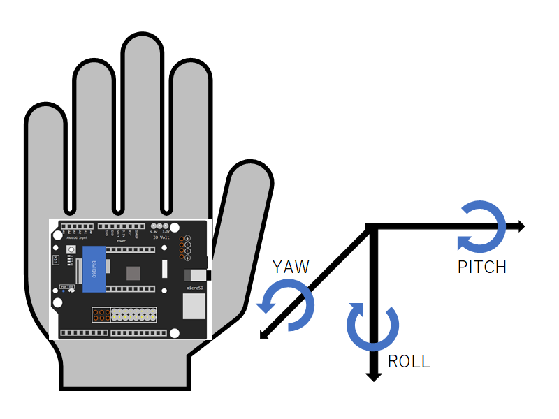

# ゆるフラ カスタネット

[ゆる楽器ハッカソン2022 IN 大阪](https://protopedia.net/event/yurumusic2022)で作られたカスタネットです。

3軸ジャイロセンサで手の動きを検出し、動きに応じた音を再生します。
三連打やそれ以上の連打が簡単に演奏できます。

## 構成ハードウェア

* [Spresense メインボード](https://developer.sony.com/ja/develop/spresense/specifications)
* [Spresense 拡張ボード](https://developer.sony.com/ja/develop/spresense/specifications)
* ジャイロセンサ (いずれかを入手して使用してください)
    * BMI270
        * [Sony Spresense 用 6軸 加速度計・ジャイロスコープセンサ (BMI270) Addon ボード](https://nextstep.official.ec/items/66165025)
        * [Sony Spresense 9軸 加速度計・ジャイロ・コンパスセンサ (BMI270・AK09918) Addon ボード](https://nextstep.official.ec/items/66165488)
    * BMI160 (文末の「ジャイロセンサにBMI160を使用する」を参考にしてください)
        * [SPRESENSE用3軸加速度・3軸ジャイロ・気圧・温度センサ アドオンボード BMP280 BMI160搭載](https://www.switch-science.com/catalog/5258/)
* microSDHCカード
* スピーカー

## 構成ソフトウェア

* Spresense Reference Board
* [Sound Signal Processing Library for Spresense](https://github.com/SonySemiconductorSolutions/ssih-music/)
* [BMI270-Sensor-API](https://github.com/TomonobuHayakawa/BMI270-Sensor-API) (ジャイロセンサにBMI270を使用する場合に必要です)
* [BMI160-Arduino](https://github.com/hanyazou/BMI160-Arduino) (ジャイロセンサにBMI160を使用する場合に必要です)

## 演奏方法



| 手の動き                 | アクション        | 鳴らす音         |
| ----                     | ----              | ----             |
| 手を手前に倒す           | PITCH(時計回り)   | 連打開始         |
| 手前に倒した手を元に戻す | PITCH(反時計回り) | 三連打(連打終了) |
| 手を横に回す             | ROLL(時計回り)    | 単音             |
| 横に回した手を元に戻す   | ROLL(反時計回り)  | 三連打           |
| 手を横に倒す             | YAW(時計回り)     | 三連打           |
| 横に倒した手を元に戻す   | YAW(反時計回り)   | 三連打           |

## 音源の作成方法

鳴らしたいカスタネットの音声ファイルを用意します。
カスタネットがない場合は、[FreePats project - World and Rare Percussion](https://freepats.zenvoid.org/Percussion/world-and-rare-percussion.html)などで配布されている音源ファイルを使うこともできます。

### 音源ファイルを作成する

1. FFmpegをインストールします
2. 収録した音声ファイルを `RECORD.wav` とします
3. 次のコマンドを実行して、Spresenseで使用できる48kHz/16bit/2chのWAVファイルに変換します
    ```bash
    ffmpeg -y -i "RECORD.wav" -ar 48000 -ac 2 -acodec pcm_s16le "SINGLE.wav"
    ```
4. 次のコマンドを実行して、秒間16連打の音を生成します (3000/48000 = 0.0625秒 = 16Hz)
    ```bash
    ffmpeg -y -i "SINGLE.wav" -filter_complex "aloop=loop=15:size=3000" "FlamencoCastanet.wav"
    ```
5. 秒間16連打の音源ファイル `FlamencoCastanet.wav` が出力されました

### SFZファイルを作成する

以下の内容で `FlamencoCastanet.sfz` を作成します。

```FlamencoCastanet.sfz
<region> key=70 sample=FlamencoCastanet.wav loop_mode=loop_continuous loop_start=0 loop_end=47999 // castanet roll
<region> key=71 sample=FlamencoCastanet.wav offset=45000 // castanet x1
<region> key=72 sample=FlamencoCastanet.wav offset=42000 // castanet x2
<region> key=73 sample=FlamencoCastanet.wav offset=39000 // castanet x3
<region> key=74 sample=FlamencoCastanet.wav offset=36000 // castanet x4
<region> key=75 sample=FlamencoCastanet.wav offset=33000 // castanet x5
<region> key=76 sample=FlamencoCastanet.wav offset=30000 // castanet x6
<region> key=77 sample=FlamencoCastanet.wav offset=27000 // castanet x7
<region> key=78 sample=FlamencoCastanet.wav offset=24000 // castanet x8
<region> key=79 sample=FlamencoCastanet.wav offset=21000 // castanet x9
```

### 音源ファイルをSDカードにインストールする

作成した `FlamencoCastanet.wav` と `FlamencoCastanet.sfz` をSDカードにコピーして、そのSDカードをSpresenseに挿入します。

## ジャイロセンサにBMI160を使用する

BMI270の代わりにBMI160を使用する場合は、 config.h を下記のように修正して、「マイコンボードに書き込む」を実行してください。

```config.h
#define GYRO_TYPE_BMI160
// #define GYRO_TYPE_BMI270
```
