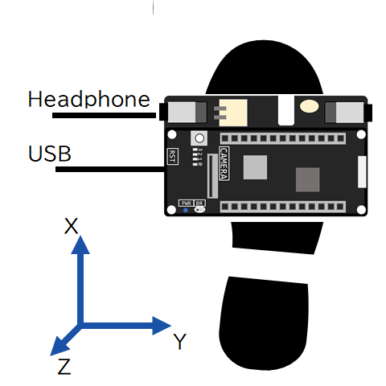
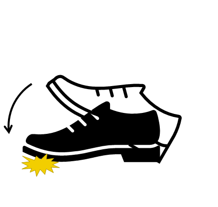
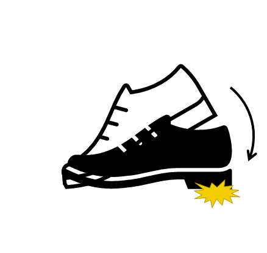

# ゆるフラ カスタネット

[ゆる楽器ハッカソン2022 IN 大阪](https://protopedia.net/event/yurumusic2022)フラメンコシューズです。

3軸加速度センサで足の動きを検出し、動きに応じた音を再生します。
やわらかい床の上でも、足の力が強くなくても、簡単に演奏できます。

## 構成ハードウェア

* [Spresense メインボード](https://developer.sony.com/ja/develop/spresense/specifications)
* [Spresense 拡張ボード](https://developer.sony.com/ja/develop/spresense/specifications)
* [B-stem PDA01](https://p-art.net/pda01-2)
* microSDHCカード
* スピーカー

## 構成ソフトウェア

* Spresense Instrument Board
* [Sound Signal Processing Library for Spresense](https://github.com/SonySemiconductorSolutions/ssih-music/)
* [Adruino libraries and samples for Rohm Sensors & Bluetooth LE](https://github.com/RohmSemiconductor/Arduino)
    * このリポジトリのKX122フォルダを、Arduinoライブラリフォルダにコピーして使用します。

## 演奏方法



上図を参考にして、面ファスナーなどで足の甲にSpresenseを貼り付けます。

| 足の動き                 | アクション        |
| ----                     | ----              |
| つま先を床に打ち付ける   | プランタ          |
| かかとを床に打ち付ける   | タコン            |




## 音源の作成方法

### 音源ファイルを用意する

鳴らしたいフラメンコシューズの音声ファイルを用意します。
音声フォーマットは48kHz/16bit/2chのWAVファイルにしてください。

1. FlamencoShoe-Planter.wav (プランタ用)
2. FlamencoShoe-Tacon.wav (タコン用)

### SFZファイルを作成する

以下の内容で `FlamencoShoe.sfz` を作成します。

```FlamencoShoe.sfz
<region> key=60 sample=FlamencoShoe-Planter.wav // 60: planta(toe), strong
<region> key=62 sample=FlamencoShoe-Tacon.wav   // 62: tacon(heel), strong
```

### 音源ファイルをSDカードにインストールする

`FlamencoShoe-Planter.wav`、`FlamencoShoe-Tacon.wav`、`FlamencoShoe.sfz` をSDカードにコピーして、そのSDカードをSpresenseに挿入します。
