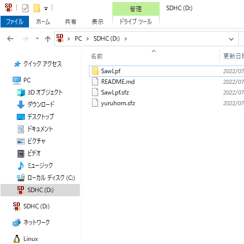
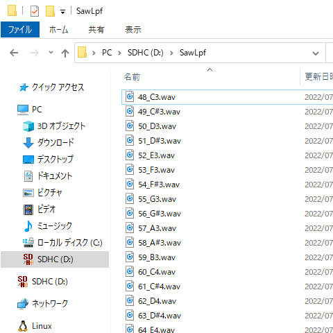
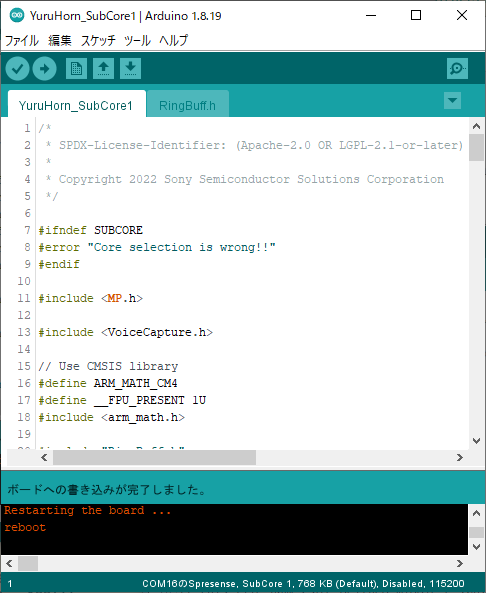
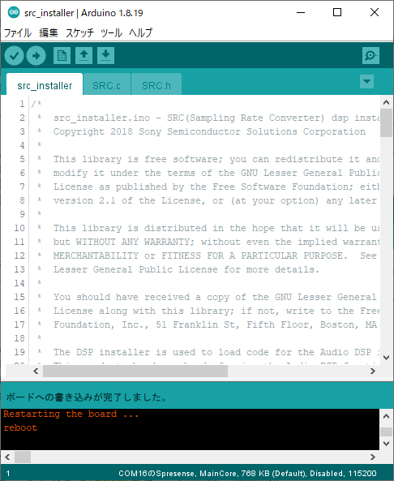
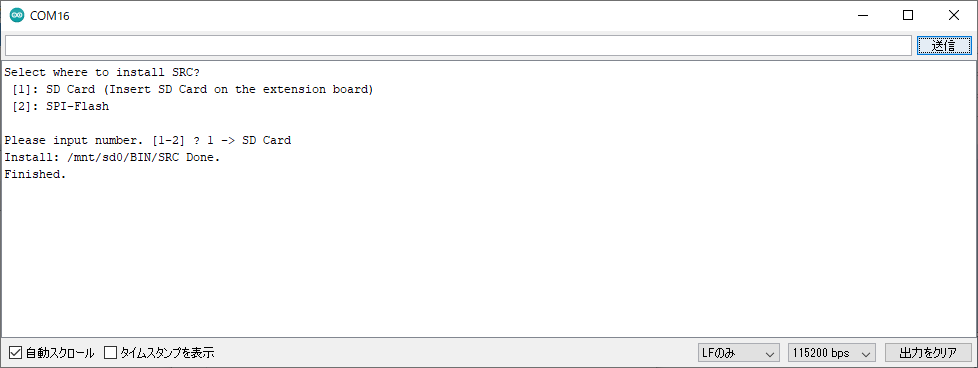
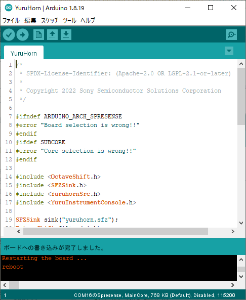

# YuruHorn

鼻歌を歌うだけでトランペットのように楽器を奏でることができるサンプルです。
SimpleHornの機能に加えて、SFZ形式の音源を演奏することができます。

## 目次

* 構成ハードウェア
* 構成ソフトウェア
* ソースコード (抜粋)
* 音源ファイルを用意する
* インストール
* 演奏方法
* 高度な設定
    * 音程をオクターブ単位で変更する

## 構成ハードウェア

* [Spresense メインボード](https://developer.sony.com/ja/develop/spresense/specifications)
* [Spresense 拡張ボード](https://developer.sony.com/ja/develop/spresense/specifications)
* microSDHCカード
    * MIDIファイル
    * SFZ音源ファイル
    * DSPバイナリファイル (SRC)
* スピーカー
* micro-B USBケーブル

## 構成ソフトウェア

* [Spresense Reference Board](https://developer.sony.com/develop/spresense/docs/arduino_set_up_ja.html)
* [Sound Signal Processing Library for Spresense](https://github.com/SonySemiconductorSolutions/ssih-music/)

## ソースコード (抜粋)

```YuruHorn.ino
#include <OctaveShift.h>
#include <SFZSink.h>
#include <YuruhornSrc.h>

SFZSink sink("SawLpf.sfz");             // SFZ音源ファイルを指定します。
OctaveShift filter(sink);
YuruhornSrc inst("score.mid", sink);    // 演奏したい楽譜ファイルを指定します。

void setup() {
    inst.begin();
}

void loop() {
    inst.update();
}
```

## 音源ファイルを用意する

[サンプル音源](https://github.com/SonySemiconductorSolutions/ssih-music/releases/latest/download/assets.zip)をダウンロードして、展開したファイルをSDカードにコピーしてください。
ダウンロードしてZIP展開したファイルをSDカードにコピーします。
SDカードの直下に "SawLpf.sfz" と "SawLpf" フォルダがある状態にしてください。




SFZファイルSawLpf.sfzにはノート番号とWAVファイルの対応関係が記述されています。
YuruHornではこのSFZファイルを`SFZSink`に設定することで、音源ファイルを簡単に切り替えることができるようになっています。

```YuruHorn.ino
// SFZ音源ファイルを指定します。
SFZSink sink("SawLpf.sfz");
```

SFZ音源ファイルは[サンプル音源](https://github.com/SonySemiconductorSolutions/ssih-music/releases/latest/download/assets.zip)(SawLpf.sfz)を使用するか、販売・配布されているものを入手してください。
販売・配布されているSFZ音源ファイルは、そのままでは本ライブラリで使用できない場合があります。
使用できない場合はインポートツール[import-sfz.py](../../tools/README.md)で変換すると使用できるようになる場合があります。

**注意: 販売・配布されているSFZ音源ファイルを使用する場合には、提供者の定める利用規約や著作権、ライセンスをよく確認し順守して使用してください。**
**インポートツールを使用する場合はSFZファイルと音声ファイルの加工を伴うため、加工に関する条項にも注意してください。**

SFZ音源ファイル配布サイトの例:
* [Versilian Studios LLC.](https://vis.versilstudios.com/)
    * [VSCO Community](https://vis.versilstudios.com/vsco-community.html)
* [Virtual Playing Orchestra](http://virtualplaying.com/virtual-playing-orchestra/)
* [The FreePats project](https://freepats.zenvoid.org/)
* [SFZ Instruments](https://sfzinstruments.github.io/)

## インストール

1. SDカードをSpresense拡張ボードに挿し込む。
2. "YuruHorn_SubCore1" をインストールする。
    1. "ファイル" > "スケッチ例" > "Sound Signal Processing Library for Spresense" > "YuruHorn_SubCore1" をクリックする。
    2. "ツール" > "ボード" > "Spresense Boards" > "Spresense" をクリックする。
    3. "ツール" > "Core" > "SubCore 1" をクリックする。
    4. "ツール" > "シリアルポート" からSpresenseが接続されているCOMポートをクリックする。
    5. "スケッチ" > "マイコンボードに書き込む" をクリックする。
    6. "ボードへの書き込みが完了しました。" と表示されるまで待つ。
3. DSPバイナリファイルをインストールする。
    1. "ファイル" > "スケッチ例" > "Audio" > "dsp_installer"  > "src_installer" をクリックする。
    2. "ツール" > "Core" > "MainCore" をクリックする。
    3. "スケッチ" > "マイコンボードに書き込む" をクリックする。
    4. "ボードへの書き込みが完了しました。" と表示されるまで待つ。
    5. "ツール" > "シリアルモニタ" をクリックする。
    6. "Select where to install SRC?" と聞かれるので "1" と入力して "送信" をクリックする。
    7. "Finished" と表示されるまで待つ。
4. "YuruHorn" をインストールする。
    1. "ファイル" > "スケッチ例" > "Sound Signal Processing Library for Spresense" > "YuruHorn" をクリックする。
    2. "ツール" > "Core" > "MainCore" をクリックする。
    3. "スケッチ" > "マイコンボードに書き込む" をクリックする。
    4. "ボードへの書き込みが完了しました。" と表示されるまで待つ。






## 演奏方法

鼻歌を歌うことでその高さに応じた音を再生します。

## 高度な設定

### 音程をオクターブ単位で変更する

YuruHornは鼻歌の高さと同じ高さの音が出力されます。
そのため、同じ曲を演奏していても声の高い人と低い人で異なる高さの音で演奏されてしまいます。

これは合奏するときに困るので、楽器の音をオクターブ単位で変更することができます。
1オクターブ低く演奏させたい場合は、以下のようにして変更します。

ただし、SFZファイルに登録されていない音は再生できません。

```YuruHorn.ino
#include <OctaveShift.h>
#include <SFZSink.h>
#include <YuruhornSrc.h>

SFZSink sink("SawLpf.sfz");             // SFZ音源ファイルを指定します。
OctaveShift filter(sink);
YuruhornSrc inst("score.mid", sink);    // 演奏したい楽譜ファイルを指定します。

void setup() {
    inst.begin();
    inst.setParam(OctaveShift::PARAMID_OCTAVE_SHIFT, -1);   // 追加: 1オクターブ低く演奏する設定
}

void loop() {
    inst.update();
}
```
